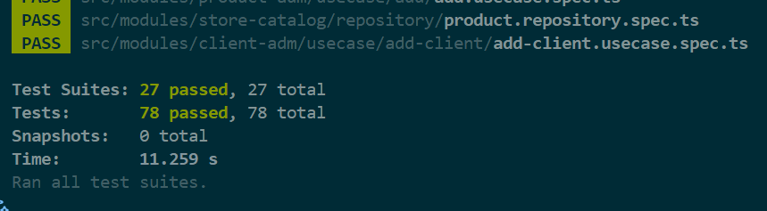

# FC3-Monolitos-InvoiceModule

## Description  
This project is part of a **Monolith System** challenge. The goal is to implement the `Repository`, `Facade`, and `Factory` for the `Checkout` module while exposing the following endpoints:

- **POST** `/products`
- **POST** `/clients`
- **POST** `/checkout/`
- **GET** `/invoice/<id>`

The implementation is written in **TypeScript** and follows **Clean Architecture** principles, ensuring separation of concerns and maintainability.

Additionally, this repository builds upon an existing project that implements the **ClientAdm, Payment, ProductAdm, StoreCatalog, and Invoice** modules. You can find that repository [here](https://github.com/LuisGaravaso/FC3-Monolitos-InvoiceModule).

## Challenge Requirements  
To successfully complete this challenge, the following requirements must be met:

- Finish implementing the **Checkout** module.  
- Ensure that the module includes the following layers: **Facade, Factory, Domain, Gateway, Repository, and Use Cases**.  
- Write **unit, integration and E2E tests** to validate the correctness of the use cases.  
- Ensure that all test cases pass successfully before submission.  
- Expose the following endpoints:  
  - **POST** `/products` → Register a new product  
  - **POST** `/clients` → Register a new client  
  - **POST** `/checkout/` → Process a checkout transaction  
  - **GET** `/invoice/<id>` → Retrieve invoice details  
- Maintain a structured codebase following **Clean Architecture** principles.  

## Installation & Setup

###
Cloning the Repository

To get started, clone the repository and navigate to the project directory:
```sh
git clone https://github.com/LuisGaravaso/FC3-Monolitos-CheckoutAPIs.git
cd FC3-Monolitos-CheckoutAPIs
```

### Prerequisites
Ensure you have the following installed on your machine:
- [Node.js](https://nodejs.org/en/download) (latest LTS version recommended)
- [npm](https://www.npmjs.com/) (included with Node.js)

### Install Dependencies
Run the following command to install the required dependencies:
```sh
npm install
```
After downloading the packages the folder `node_modules` should appear.

## Running Tests
To execute all unit tests, use the following command:
```sh
npm test
```
All tests should pass as follows.



## Clean Architecture Concepts  
This project follows **Clean Architecture** principles, structured around key concepts:  

### Entity  
Entities are objects with a distinct identity that persist over time. They encapsulate core business rules and behaviors. Examples in this project include:  
- `InvoiceItems`  
- `Invoice`  

### Gateway  
We use the **Gateway Design Pattern** to define an interface for the **Repository**, ensuring a clear contract for persistence operations.  

### Repository  
Repositories provide an abstraction layer between domain objects and the persistence mechanism. They handle operations such as storing, retrieving, and updating domain entities. Example:  
- `InvoiceRepository`  

### Use Case  
Use cases define the application's business logic by orchestrating interactions between entities and repositories. They encapsulate workflows and enforce business rules to ensure consistency and integrity. Examples include:  
- `FindInvoiceUseCase`  
- `GenerateInvoiceUseCase`  

### Facade  
Since we are implementing a **monolithic system**, we use **Facades** to facilitate communication between different modules in a structured and maintainable way.  

### Factory  
This project includes a **Factory Design Pattern** implementation to streamline the creation of the **Facade** and its dependencies.  

## Project Structure
The project follows a structured **Clean Architecture** approach:
```
/src/mod
│── @shared/                 # Shared domain logic, including core business rules and utilities
│── api/                     # API layer for handling HTTP requests
│   ├── __test__/            # End-to-end tests for API routes
│   │     ├── checkout.e2e.spec.ts  
│   │     ├── customer.e2e.spec.ts  
│   │     ├── invoice.e2e.spec.ts  
│   │     ├── product.e2e.spec.ts  
│   ├── routes/              # API route handlers
│   │     ├── checkout.route.ts  
│   │     ├── customer.route.ts  
│   │     ├── invoice.route.ts  
│   │     ├── product.route.ts  
│   ├── express.ts           # Express app configuration
│   ├── server.ts            # Server entry point
│── checkout/                # Checkout module
│   ├── domain/              # Core domain logic (entities, value objects, aggregates)
│   ├── facade/              # Facade layer for interacting with other modules
│   ├── factory/             # Factory methods for creating use cases and dependencies
│   ├── gateway/             # Interfaces defining contracts for repositories and external services
│   ├── repository/          # Implementation of repositories for data persistence
│   ├── usecase/             # Business logic and use case implementations
│── client-adm/              # Client Administration module (follows the same structure as checkout)
│── invoice/                 # Invoice module (follows the same structure as checkout)
│── payment/                 # Payment module (follows the same structure as checkout)
│── product-adm/             # Product Administration module (follows the same structure as checkout)
│── store-catalog/           # Store Catalog module (follows the same structure as checkout)

```
**NOTE: Only the main folders for this challenge are expanded**

## Database
- This project uses **SQLite** as an in-memory database for testing purposes.
- No additional database setup is required.


## 🧪 Test Coverage Summary  

This challenge includes a **comprehensive test suite** to ensure the correctness, reliability, and maintainability of the system.  

### ✅ Unit Tests  
Unit tests validate individual components in **isolation**, ensuring that each function, class, or module behaves as expected.  
These tests do **not** interact with external dependencies such as databases or APIs.  

#### Implemented Unit Tests:  
- `checkout.facade.spec.ts` – Tests the facade layer logic for the checkout module.  
- `order.repository.spec.ts` – Validates the repository implementation for order persistence.  

### 🔍 End-to-End (E2E) Tests  
End-to-end tests validate the **entire request flow**, ensuring that the system functions correctly as a whole, including API routes and integrations.

#### Implemented E2E Tests:  
- `checkout.e2e.spec.ts` – Validates the checkout process, ensuring order creation and processing.  
- `customer.e2e.spec.ts` – Tests customer registration and retrieval operations.  
- `invoice.e2e.spec.ts` – Ensures invoice generation and retrieval functionality.  
- `product.e2e.spec.ts` – Validates product creation and management.  

### Other Tests  
- Additional tests for related modules and integrations are available in the main repository.  
- More details can be found [here](https://github.com/LuisGaravaso/FC3-Monolitos-InvoiceModule).